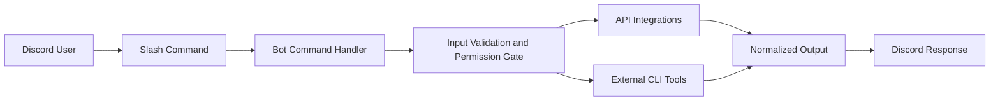

# Discord OSINT Assistant

[](https://github.com/gl0bal01/discord-osint-assistant/actions/workflows/ci.yml)
[](LICENSE)
[](https://doi.org/10.5281/zenodo.15741849)

Discord OSINT Assistant is a self-hosted Discord intelligence bot for Open Source Intelligence (OSINT) investigations. It exposes 32 investigation workflows as Discord slash commands for reconnaissance, attribution, enrichment, and analysis.

## In Two Minutes

```bash
git clone https://github.com/gl0bal01/discord-osint-assistant.git
cd discord-osint-assistant
bun install                       # or: npm install
cp .env.example .env              # set DISCORD_TOKEN and CLIENT_ID
bun run deploy
bun run start
```

## Why This Project

- Standardize OSINT workflows for teams working inside Discord
- Reduce setup overhead for investigators and analysts
- Keep operational controls close to command execution (validation, permissions, rate limits)
- Integrate API-based and CLI-based data sources behind one command surface

## Features

- 31 slash commands across identity, network, media, blockchain, transport, business, analysis, and operations workflows
- `/bob-chat` supports multi-model chat, code generation, OSINT analysis, and speech-to-text transcription
- Optional integrations with third-party APIs and local external tools
- Security-focused runtime controls for process execution and URL handling
- Container-ready deployment and CI validation

## Architecture



## Command Catalog

The bot currently provides 32 commands across 8 functional areas. Run `/bob-help` in Discord to list every command live with its description.

### Identity and Social

`/bob-sherlock`, `/bob-maigret`, `/bob-linkook`, `/bob-ghunt`, `/bob-generate-usernames`, `/bob-nuclei`

### Domain and Network

`/bob-dns`, `/bob-whoxy`, `/bob-hostio`, `/bob-recon-web`, `/bob-redirect-chain`, `/bob-favicons`

### Image and Media

`/bob-exif`, `/bob-rekognition`

### Blockchain

`/bob-blockchain`, `/bob-blockchain-detect`

### Transportation

`/bob-aviation`, `/bob-airport`, `/bob-flight-number`, `/bob-vessels`

### Business Intelligence

`/bob-pappers`, `/bob-vpic`, `/bob-nike`

### Analysis

`/bob-chat`, `/bob-jwt`, `/bob-xeuledoc`, `/bob-extract-links`, `/bob-dork`

### `/bob-chat` Subcommands

#### `ask`

General AI assistance with optional context presets.

| Parameter | Required | Description |
|-----------|----------|-------------|
| `message` | **Yes** | Your question or request (max 2000 chars) |
| `model`   | No       | `qwen3-vl-flash` (default), `gpt-5.4-mini`, `sonar-reasoning-pro`, `grok-4-fast-reasoning` |
| `context` | No       | `general` (default), `osint`, `data`, `investigation`, `technical`, `report` |

**Example**
```
/bob-chat ask message:"Analyze this breach data for patterns" model:sonar-reasoning-pro context:osint
```

---

#### `code`

Generate code for OSINT automation and data analysis.

| Parameter    | Required | Description |
|--------------|----------|-------------|
| `request`    | **Yes**  | Describe the code you need (max 2000 chars) |
| `language`   | No       | `python` (default), `javascript`, `bash`, `powershell`, `sql`, `other` |
| `model`      | No       | `qwen3-coder-plus` (default), `claude-sonnet-4-6`, `gemini-3.1-pro-preview`, `gpt-5.4`, `grok-code-fast-1` |
| `new-context`| No       | Start a fresh code conversation (`false` by default) |

**Example**
```
/bob-chat code request:"Script that fetches subdomains from crt.sh" language:python model:qwen3-coder-plus
```

---

#### `analyze`

Structured OSINT analysis of findings or raw data.

| Parameter       | Required | Description |
|-----------------|----------|-------------|
| `data`          | **Yes**  | The data or findings to analyze (max 2000 chars) |
| `analysis-type` | No       | `summary` (default), `pattern`, `threat`, `link`, `timeline`, `risk` |

**Example**
```
/bob-chat analyze data:"IP 198.51.100.5 contacted our honeypot 42 times using user-agent 'Mozilla/5.0 CustomBot'" analysis-type:threat
```

**Analysis types**
- `pattern` – Pattern recognition and anomaly detection
- `threat` – Threat assessment and security implications
- `link` – Relationship and connection mapping
- `timeline` – Timeline reconstruction from events
- `risk` – Risk assessment
- `summary` – High-level summary and key insights

---

#### `transcribe`

Speech-to-text via 1min.ai audio models.

| Parameter    | Required | Description |
|--------------|----------|-------------|
| `audio-url`  | **Yes**  | Asset path returned by the 1min.ai Asset API (e.g. `fileContent.path`) |
| `stt-model`  | No       | `qwen3-asr-flash` (default) or `phone_call` |
| `language`   | *Cond.*  | **Required** for `phone_call` (BCP-47 style, e.g. `en-US`, `vi-VN`, `zh-CN`). Optional for `qwen3-asr-flash` (e.g. `en`, `zh`, `ja`; auto-detect if omitted) |
| `enable-itn` | No       | Qwen3 only: enable inverse text normalization (`false` by default) |

**Transcription workflow**
1. Upload your audio file to the 1min.ai Asset API (`POST /api/assets`).
2. Copy the returned asset path (usually inside `fileContent.path`).
3. Run the slash command with that path.

**Example – Qwen3 ASR Flash (auto-detect language)**
```
/bob-chat transcribe audio-url:"https://cdn.1min.ai/.../recording.wav"
```

**Example – Qwen3 ASR Flash (explicit language + ITN)**
```
/bob-chat transcribe audio-url:"https://cdn.1min.ai/.../recording.wav" language:en enable-itn:true
```

**Example – Phone Call model**
```
/bob-chat transcribe audio-url:"https://cdn.1min.ai/.../call.wav" stt-model:phone_call language:en-US
```

---

#### `reset`

Clear conversation context so the next interaction starts fresh.

| Parameter | Required | Description |
|-----------|----------|-------------|
| `model`   | No       | `all` (default), `chat`, `code`, `analysis` |

**Example**
```
/bob-chat reset model:code
```

### Operations

`/bob-monitor`, `/bob-health`, `/bob-upload`, `/bob-help`

---

### `/bob-upload`

Upload a Discord attachment to the 1min.ai Asset API so it can be referenced by AI features (e.g. `/bob-chat transcribe`).

| Parameter | Required | Description |
|-----------|----------|-------------|
| `file`    | **Yes**  | The file to upload (max 50 MB) |

**Supported file types**
- Images: PNG, JPEG, WEBP, GIF, SVG
- Documents: PDF, DOC, DOCX, TXT
- Data: JSON, CSV, XML
- Audio: WAV, MP3, OGG, M4A (for transcription)

**Example**
```
/bob-upload file:<attach your audio file>
```

**Response fields**
- **Asset Path** (`fileContent.path`) — the value you pass to `audio-url` in `/bob-chat transcribe`
- **UUID** — unique identifier for the uploaded asset
- **Direct URL** — full S3 location (requires authentication)

**Workflow for transcription**
1. Run `/bob-upload` and attach your audio file.
2. Copy the **Asset Path** from the response.
3. Run `/bob-chat transcribe audio-url:<asset-path>`.

---

### `/bob-ghunt` Authentication

GHunt requires a valid Google session before it can perform lookups. The bot can detect login status and accept fresh credentials directly from Discord.

| Operation | Parameter | Description |
|-----------|-----------|-------------|
| `type:check-login` | — | Verify whether GHunt credentials exist and are valid |
| `type:login` | `query` or `token` | Save a new base64 token from GHunt Companion |
| `type:email` | `query` | Lookup an email address |
| `type:gaia` | `query` | Lookup a Gaia ID |
| `type:drive` | `query` | Analyze a Google Drive file/folder URL |
| `type:geolocate` | `query` | Geolocate a BSSID (`XX:XX:XX:XX:XX:XX`) |
| `type:spiderdal` | `query` | Find assets using Digital Asset Links |

**How to authenticate**
1. Install the [GHunt Companion](https://github.com/mxrch/GHunt/tree/master/gc-assets) browser extension (Firefox or Chrome).
2. Log in to your Google account in the browser.
3. Click the extension icon and copy the base64 string.
4. Run the login command:
   ```
   /bob-ghunt type:login query:<paste-base64-here>
   ```

**Check your session**
```
/bob-ghunt type:check-login
```

**Run a lookup**
```
/bob-ghunt type:email query:target@gmail.com
```

**Environment variable**
- `GHUNT_CREDS_PATH` — custom path for the credentials file (default: `~/.malfrats/ghunt/creds.m`)

## Prerequisites

- Node.js 20+
- Discord bot application and token
- Bun (optional)
- Docker (optional)

## Installation

See the unified clone/install/deploy/start snippet under [In Two Minutes](#in-two-minutes). Bun is preferred; `npm` works for every script.

### Docker

```bash
cp .env.example .env
docker compose up -d            # or: make up
```

## Configuration

Copy `.env.example` to `.env` and configure at minimum:

- `DISCORD_TOKEN`
- `CLIENT_ID`

Optional integrations unlock additional commands:

- API services such as Whoxy, DNSDumpster, Host.io, AviationStack, and AWS Rekognition
- External CLI tools such as Sherlock, Maigret, Nuclei, ExifTool, GHunt, xeuledoc, Linkook, and jwt_tool

If an optional dependency is missing, the related command returns a descriptive runtime error.

## Logging

The bot uses [pino](https://getpino.io/) for structured JSON logging.

| Variable    | Default | Accepted values                          |
|-------------|---------|------------------------------------------|
| `LOG_LEVEL` | `info`  | `trace`, `debug`, `info`, `warn`, `error`, `fatal` |

In development (non-production and interactive TTY) logs are pretty-printed via `pino-pretty`. In production, raw JSON is written to stdout for ingestion by log aggregators.

Sensitive fields (`token`, `authorization`, `password`, `api_key`, `headers.authorization`, `headers.cookie`) are automatically redacted to `[REDACTED]` before output.

## Security

This project executes investigations against user-provided input and applies defensive controls by default.

- Argument-array process execution with restricted child-process environments
- SSRF protections on URL-capable commands
- Centralized validators for usernames, domains, URLs, emails, and IP addresses
- Permission gating for high-impact commands
- Per-user rate limits and daily usage controls

See [SECURITY.md](SECURITY.md) for full details.

## Development

```bash
bun run dev          # nodemon hot-reload
bun run test         # vitest
bun run lint         # eslint
bun run smoke        # quick boot/health probe
```

Slash command registration (`deploy`, `deploy:global`, `clear`, `clear:global`, `clear:all`, `clear:list`) and other scripts live in `package.json`. Run `bun run` with no args to see them all.

Contribution guidance is available in [CONTRIBUTING.md](CONTRIBUTING.md).

## Deployment

The bot exits with code 1 on `uncaughtException` or `unhandledRejection`, so it must run under a supervisor that restarts on failure. A `Makefile` wraps both supported paths.

### systemd (recommended)

The repository ships a unit at `deploy/discord-osint-assistant.service` with `Restart=always` and full sandboxing.

```bash
make install           # creates botuser, copies repo to /opt, installs unit, enables service
make restart           # restart after code update
make update            # git pull + bun install + restart
make logs-tail         # follow journald
```

Override the install path with `make INSTALL_DIR=/srv/bot install`. Run `make help` to list every target.

### Docker Compose

```bash
make up                # build + start (or: docker compose up -d --build)
make dlogs             # follow logs
make dhealth           # show healthcheck state
make down              # stop and remove
```

The container runs read-only with `cap_drop: ALL`, tmpfs for `/app/temp`, and a built-in healthcheck (`scripts/healthcheck.js`).

PM2 is not supported — it needs a writable `~/.pm2` which conflicts with the hardened `read_only` container and systemd `ProtectHome=true`.

## License

MIT. See [LICENSE](LICENSE).
