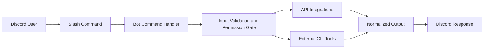

# Discord OSINT Assistant

[](https://github.com/gl0bal01/discord-osint-assistant/actions/workflows/ci.yml)
[](LICENSE)
[](https://doi.org/10.5281/zenodo.15741849)

Discord OSINT Assistant is a self-hosted Discord intelligence bot for Open Source Intelligence (OSINT) investigations. It exposes 30 investigation workflows as Discord slash commands for reconnaissance, attribution, enrichment, and analysis.

## In Two Minutes

```bash
git clone https://github.com/gl0bal01/discord-osint-assistant.git
cd discord-osint-assistant
npm install
cp .env.example .env
# set DISCORD_TOKEN and CLIENT_ID in .env
npm run deploy
npm run start
```

## Why This Project

- Standardize OSINT workflows for teams working inside Discord
- Reduce setup overhead for investigators and analysts
- Keep operational controls close to command execution (validation, permissions, rate limits)
- Integrate API-based and CLI-based data sources behind one command surface

## Features

- 30 slash commands across identity, network, media, blockchain, transport, business, and analysis workflows
- `/bob-chat` supports multi-model chat, code generation, OSINT analysis, and speech-to-text transcription
- Optional integrations with third-party APIs and local external tools
- Security-focused runtime controls for process execution and URL handling
- Container-ready deployment and CI validation

## Architecture



## Command Catalog

The bot currently provides 30 commands across 8 functional areas.

### Identity and Social

`/bob-sherlock`, `/bob-maigret`, `/bob-linkook`, `/bob-ghunt`, `/bob-generate-usernames`, `/bob-nuclei`

### Domain and Network

`/bob-dns`, `/bob-whoxy`, `/bob-hostio`, `/bob-recon-web`, `/bob-redirect-chain`, `/bob-favicons`

### Image and Media

`/bob-exif`, `/bob-rekognition`

### Blockchain

`/bob-blockchain`, `/bob-blockchain-detect`

### Transportation

`/bob-aviation`, `/bob-airport`, `/bob-flight-number`, `/bob-vessels`

### Business Intelligence

`/bob-pappers`, `/bob-vpic`, `/bob-nike`

### Analysis

`/bob-chat`, `/bob-jwt`, `/bob-xeuledoc`, `/bob-extract-links`, `/bob-dork`

### `/bob-chat` Subcommands

- `ask`: general AI assistance with context presets
- `code`: code generation with selectable coding models
- `analyze`: structured OSINT analysis prompts
- `transcribe`: speech-to-text using 1min.ai audio models
- `reset`: clears chat/code/analysis context

#### `/bob-chat ask` Models

- `qwen3-vl-flash`
- `gpt-5.4-mini`
- `sonar-reasoning-pro`
- `grok-4-fast-reasoning`

#### `/bob-chat code` Models

- `qwen3-coder-plus`
- `claude-sonnet-4-6`
- `gemini-3.1-pro-preview`
- `gpt-5.4`
- `grok-code-fast-1`

#### `/bob-chat transcribe` Models

- `qwen3-asr-flash`
  - `language` is optional (auto-detect supported)
  - `enable-itn` optional (English/Chinese normalization)
- `phone_call`
  - `language` is required (for example `en-US`, `en-GB`, `vi-VN`, `zh-CN`)

Note: For transcription, upload audio to 1min.ai Asset API first and pass the returned asset path to `audio-url`.

### Operations

`/bob-monitor`, `/bob-health`

## Prerequisites

- Node.js 20+
- Discord bot application and token
- Bun (optional)
- Docker (optional)

## Installation

### Local (npm)

```bash
git clone https://github.com/gl0bal01/discord-osint-assistant.git
cd discord-osint-assistant
npm install
cp .env.example .env
npm run deploy
npm run start
```

### Local (Bun)

```bash
git clone https://github.com/gl0bal01/discord-osint-assistant.git
cd discord-osint-assistant
bun install
cp .env.example .env
bun run deploy
bun run start
```

### Docker

```bash
cp .env.example .env
docker compose up -d
```

## Configuration

Copy `.env.example` to `.env` and configure at minimum:

- `DISCORD_TOKEN`
- `CLIENT_ID`

Optional integrations unlock additional commands:

- API services such as Whoxy, DNSDumpster, Host.io, AviationStack, and AWS Rekognition
- External CLI tools such as Sherlock, Maigret, Nuclei, ExifTool, GHunt, xeuledoc, Linkook, and jwt_tool

If an optional dependency is missing, the related command returns a descriptive runtime error.

## Security

This project executes investigations against user-provided input and applies defensive controls by default.

- Argument-array process execution with restricted child-process environments
- SSRF protections on URL-capable commands
- Centralized validators for usernames, domains, URLs, emails, and IP addresses
- Permission gating for high-impact commands
- Per-user rate limits and daily usage controls

See [SECURITY.md](SECURITY.md) for full details.

## Development

```bash
npm run dev
npm run test
npm run lint
```

Operational scripts:

- `npm run deploy`
- `npm run deploy:global`
- `npm run clear`
- `npm run clear:global`
- `npm run clear:all`
- `npm run clear:list`

Contribution guidance is available in [CONTRIBUTING.md](CONTRIBUTING.md).

## License

MIT. See [LICENSE](LICENSE).
